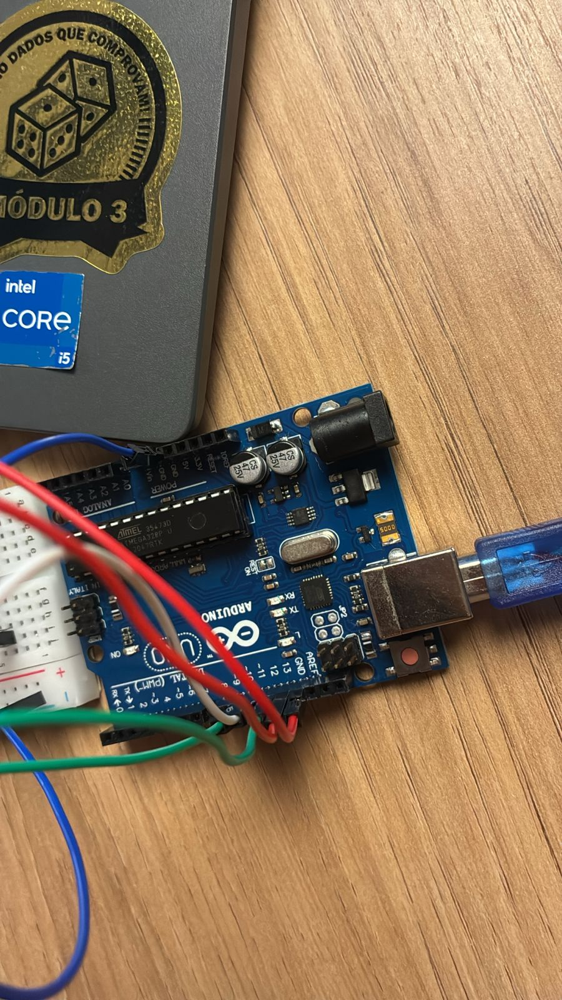
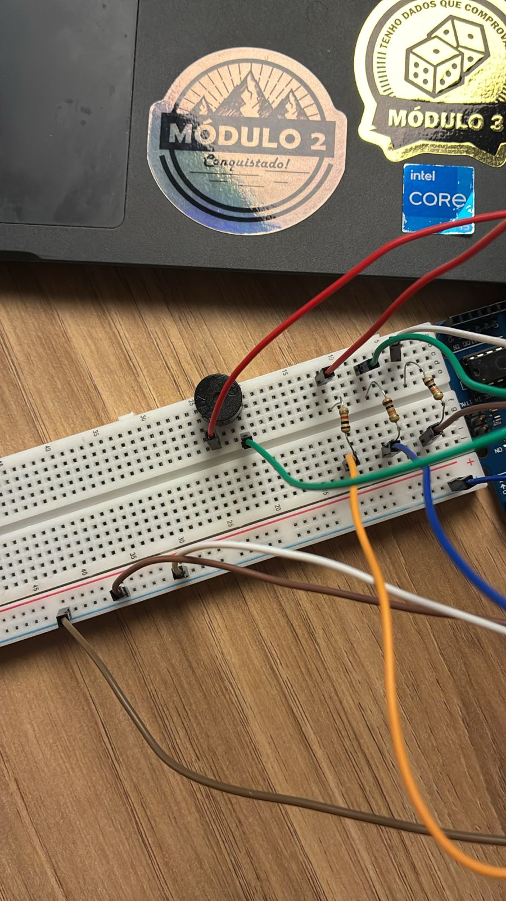
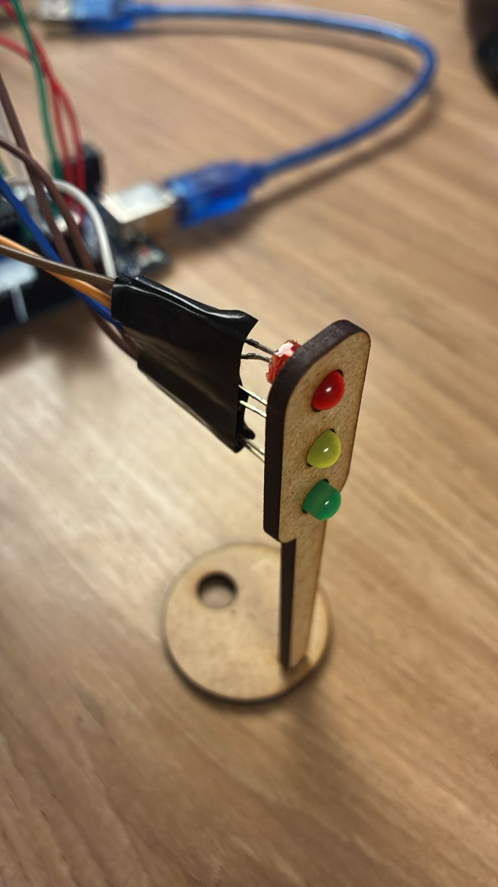

# 🚦 Projeto: Semáforo Inteligente (Offline)

Este projeto foi desenvolvido para a ponderada de programação do Módulo 04 com o objetivo de montar e programar um semáforo funcional que garanta a segurança de pedestres e veículos, seguindo uma lógica de tempo específica para cada fase das luzes (vermelho, amarelo e verde).

## 🎥 Demonstração em Vídeo

O vídeo abaixo demonstra a montagem física do circuito e o semáforo em pleno funcionamento, seguindo os tempos programados.

➡️ [Veja o vídeo clicando aqui!](../../assets/semaforo.mp4)

ou acesse a pasta assets e clique no vídeo denominado `semaforo.mp4`!


---

## 🛠️ Parte 1: Montagem Física (Hardware)

A montagem física foi realizada utilizando um Arduino Uno, uma protoboard, LEDs e resistores. As imagens do projeto ilustram as conexões.

### Componentes Utilizados

A tabela abaixo detalha todos os componentes necessários para a replicação do projeto:

| Componente | Especificação/Função | Quantidade |
| :--- | :--- | :--- |
| **Microcontrolador** | Arduino Uno R3 | 1 |
| **Protoboard** | 400 pontos (ou similar) | 1 |
| **LED Vermelho** | Difuso, 5mm | 1 |
| **LED Amarelo** | Difuso, 5mm | 1 |
| **LED Verde** | Difuso, 5mm | 1 |
| **Resistor** | 220Ω | 3 |
| **Fios Jumper** | Macho-Macho | Vários |
| **Cabo USB** | Tipo A/B (para Arduino) | 1 |
| **Estrutura** | Módulo de semáforo em MDF (Opcional) | 1 |

### Tutorial e Justificativas da Montagem

O circuito foi montado com base no esquema padrão de controle de LEDs com Arduino, visando clareza e funcionalidade.

1.  **Alimentação (GND):** O pino `GND` (Terra) do Arduino foi conectado ao trilho negativo (linha azul) da protoboard. Isso estabelece um "terra comum" essencial para que todos os componentes funcionem no mesmo circuito.

2.  **Conexão dos LEDs:** Cada LED possui dois terminais: o Ânodo (perna mais longa, positiva) e o Cátodo (perna mais curta, negativa).
    * O **Cátodo (perna curta)** de *cada um* dos três LEDs (vermelho, amarelo e verde) foi conectado diretamente ao trilho `GND` (negativo) da protoboard.

3.  **Conexão dos Resistores e Sinais:**
    * **Justificativa:** O resistor de 220Ω é fundamental. Ele é usado para **limitar a corrente** que flui do pino digital do Arduino (que fornece 5V) para o LED. Sem ele, o LED receberia uma corrente excessiva e queimaria instantaneamente.
    * O **Ânodo (perna longa)** de cada LED foi conectado a um terminal do seu respectivo resistor de 220Ω.
    * O outro terminal de cada resistor foi então conectado a um pino de saída digital do Arduino, que enviará o sinal para acender ou apagar o LED.

### Mapeamento de Pinos

Para este projeto, as conexões de sinal (saída) do Arduino para os LEDs são:

* **LED Verde:** Conectado ao **Pino Digital 11**
* **LED Amarelo:** Conectado ao **Pino Digital 12**
* **LED Vermelho:** Conectado ao **Pino Digital 13**

### Imagens da Montagem

| Placa Arduino e Conexões | Circuito na Protoboard | Semáforo em MDF |
| :---: | :---: | :---: |
|  |  |  |

---

## 💻 Parte 2: Programação e Lógica (Software)

O software (sketch) foi desenvolvido na IDE do Arduino para controlar o ciclo do semáforo com a temporização exata solicitada.

### Lógica de Funcionamento

O programa controla o semáforo para alternar entre as fases, seguindo a lógica de tempo:

1.  **Sinal Verde:** Permanece aceso por **4 segundos** (4000 ms).
2.  **Sinal Amarelo:** Acende (após o verde apagar) e permanece aceso por **2 segundos** (2000 ms).
3.  **Sinal Vermelho:** Acende (após o amarelo apagar) e permanece aceso por **6 segundos** (6000 ms).

Este ciclo (Verde → Amarelo → Vermelho) se repete indefinidamente na função `loop()`.

### Código-Fonte (`semaforo_butanta.ino`)

```cpp
void setup() {
  // Criando ponteiros para os pinos
  int *ledVermelho = new int(13);
  int *ledAmarelo  = new int(12);
  int *ledVerde    = new int(11);
  int *buzzer      = new int(10);

  // Configurando os pinos
  pinMode(*ledVermelho, OUTPUT);
  pinMode(*ledAmarelo, OUTPUT);
  pinMode(*ledVerde, OUTPUT);
  pinMode(*buzzer, OUTPUT);

}

void loop() {
  // Recriando os ponteiros aqui também (simples e direto)
  int *ledVermelho = new int(13);
  int *ledAmarelo  = new int(12);
  int *ledVerde    = new int(11);
  int *buzzer      = new int(10);

  // Vermelho por 6 segundos
  digitalWrite(*ledVermelho, HIGH);
  delay(6000);
  digitalWrite(*ledVermelho, LOW);

  // Amarelo por 2 segundos
  digitalWrite(*ledAmarelo, HIGH);
  delay(2000);
  digitalWrite(*ledAmarelo, LOW);

  // Verde (4s) + Buzzer (1s)
  digitalWrite(*ledVerde, HIGH);
  digitalWrite(*buzzer, HIGH);
  delay(1000);
  digitalWrite(*buzzer, LOW);
  delay(3000);
  digitalWrite(*ledVerde, LOW);

  // Amarelo por 2 segundos
  digitalWrite(*ledAmarelo, HIGH);
  delay(2000);
  digitalWrite(*ledAmarelo, LOW);
}

```

### ⭐ Extra: Alerta Sonoro
* **Conexão:** Conforme visto nas imagens do projeto, o buzzer foi conectado ao **Pino Digital 10**. Um terminal (geralmente positivo) foi conectado ao pino 10 e o outro (negativo) ao `GND`.

* **Funcionamento:** Ele é programado para tocar por **1 segundo (1000ms)** *exatamente no momento em que o sinal verde é ativado*.